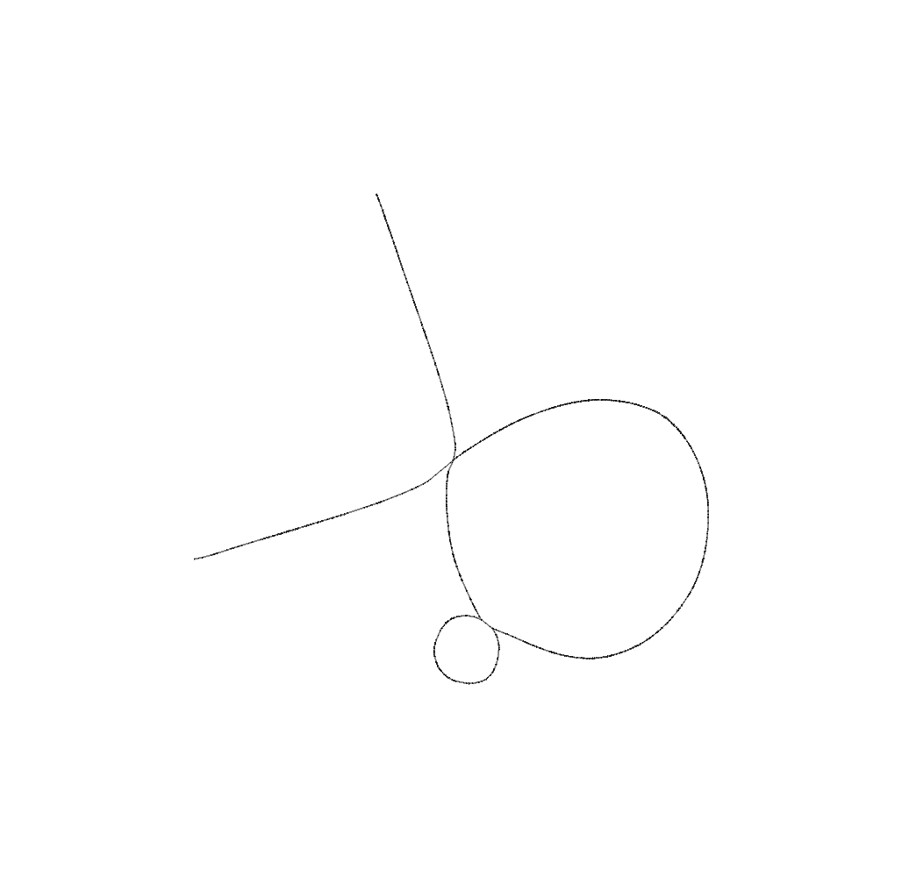

# HPRCv2
pangenome alignment, implicit/explicit graph, and variants for human pangenome project release 2

## Pangenome alignment

Get the pangenome alignment - generated with [WFMASH](https://github.com/waveygang/wfmash) - at https://garrisonlab.s3.amazonaws.com/hprcv2/pafs/hprc25272.aln.paf.gz.

## Implicit pangenome graph

Get the IMPG index - generated with [IMPG](https://github.com/pangenome/impg) - at https://garrisonlab.s3.amazonaws.com/hprcv2/impg/hprc25272.aln.paf.gz.impg.

We built the IMPG index with the following command:

```bash
impg index -p hprc25272.aln.paf.gz 
```

which requires the bgzipped PAF file (representing the pangenome alignment) and its bgzip index (`.gzi` file). The latter can be found at https://garrisonlab.s3.amazonaws.com/hprcv2/pafs/hprc25272.aln.paf.gz.gzi or generated from the bgzipped PAF file with the following command:

```bash
bgzip -r hprc25272.aln.paf.gz 
```

Put the IMPG index in the same directory as the PAF file, and then you can query the pangenome alignment with [IMPG](https://github.com/pangenome/impg).

### What you can do with an implicit pangenome graph

Get a region-of-interest (ROI) pangenome:

```bash
impg query -p hprc25272.paf.gz -r GRCh38#0#chr8:5748405-13676927 --merge-distance 1000000 > hprcv2.human8p23-1.bed

awk '$3-$2>=2000000' hprcv2.human8p23-1.bed | sort | head | column -t
    CHM13#0#chr8                 7491000  11605998  .  .  -
    GRCh38#0#chr8                5748405  13676927  .  .  +
    HG00097#1#CM094064.1         7660033  11772000  .  .  -
    HG00097#2#CM094079.1         7506003  11613398  .  .  -
    HG00099#1#CM087320.1         7529012  11754000  .  .  -
    HG00099#2#CM087363.1         7598012  11827000  .  .  -
    HG00126#1#JBHIKU010000039.1  7663003  11762000  .  .  -
    HG00126#2#CM090126.1         7753017  11898998  .  .  +
    HG00128#1#CM090082.1         7696008  11797000  .  .  -
    HG00128#2#JBHIKT010000047.1  5598009  9704000   .  .  -
```

Make a ROI explicit pangenome graph with [PGGB](https://github.com/pangenome/pggb):

```bash
ls /lizardfs/guarracino/pangenomes/HPRCv2/*.fa.gz > hprcv2.fasta-paths.txt # prepare a list of FASTA files for the pangenome sequence
impg query -p hprc25272.aln.paf.gz -r GRCh38#0#chr6:31972057-32055418 -o fasta --fasta-list hprcv2.fasta-paths.txt | bgzip -l 9 -@ 16 > hprc25272.C4.fa.gz # get the ROI pangenome in FASTA format
samtools faidx hprc25272.C4.fa.gz # index the ROI FASTA file
pggb -i hprc25272.C4.fa.gz -o pggb.hprc25272.C4 # build the ROI pangenome graph with PGGB
```

This is the resulting graph visualized with [ODGI](https://github.com/pangenome/odgi):



Compute haplotype pairwise similarity in a ROI pangenome:

```bash
impg similarity -p hprc25272.aln.paf.gz -r GRCh38#0#chr11:69809968-69819416 --fasta-list hprcv2.fasta-paths.txt --delim '#' --delim-pos 2 -v 1 > hprc25272.FGF3C4.similarity.tsv # use the --delim and --delim-pos options to get sample#haplotype_id (PanSN-spec)


```

Perform principal component analysis (PCA) on a ROI pangenome:

```bash
echo -e "GRCh38#0#chr17\t42800000\t46800000" > 17q21.bed
bedtools makewindows -b 17q21.bed -w 5000 > 17q21.windows5kb.bed

impg similarity -p hprc25272.aln.paf.gz -b 17q21.windows5kb.bed --fasta-list hprcv2.fasta-paths.txt --pca --pca-components 1 --delim '#' --threads 32 -v 1 > pca_results.txt
```

Partition the pangenome by using CHM13 chromosomes as starting sequences:

```bash
cut -f 1 chm13v2.0_maskedY_rCRS.fa.PanSN.fa.gz.fai > starting-sequences.txt # prepare the list of starting sequences
impg partition -p hprc25272.aln.paf.gz --window-size 1000000 --max-depth 5 --min-missing-size 10000 --merge-distance 1000000  --min-transitive-len 1000 --starting-sequences-file starting-sequences.txt    --selection-mode total --output-folder partitions -t 32 -v 1
```

The latter command was used to partition the whole HPRCv2 pangenome, build explicit pangenome graphs for each partition with PGGB, and lace all partition-specific graphs into a single "explicit" pangenome graph with GFALACE.

## Explicit pangenome graph

Get the explicit whole-pangenome PGGB-graph at https://garrisonlab.s3.amazonaws.com/hprcv2/gfas/w1000000-m5-f10000-d1000000-l1000-chm13-total.tmp.fix.gfa.gz.

## Variants

Get the whole-pangenome PGGB-graph variants called with VG DECONSTRUCT with respect to:
- GRCh38 at https://garrisonlab.s3.amazonaws.com/hprcv2/vcfs/hprc8424.GRCh38.merged.norm.vcf.gz
- CHM13 at https://garrisonlab.s3.amazonaws.com/hprcv2/vcfs/hprc8424.CHM13.merged.norm.vcf.gz
