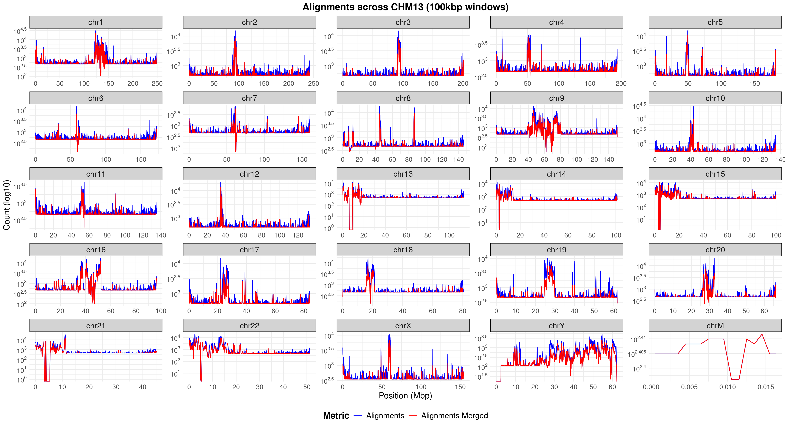
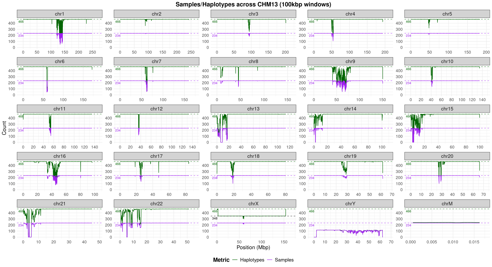

# HPRCv2
pangenome alignment, implicit/explicit graph, and variants for human pangenome project release 2

## Pangenome alignment

Get the pangenome alignment generated with [WFMASH](https://github.com/waveygang/wfmash) (`wfmash -p 95 -P inf`) at:
- 25221 pairwise alignments at https://garrisonlab.s3.amazonaws.com/hprcv2/pafs/hprc25272.aln.paf.gz
- 465 haplotype vs CHM13 at https://garrisonlab.s3.amazonaws.com/hprcv2/pafs/hprc465vschm13.aln.paf.gz
- 465 haplotype vs GRCh38 at https://garrisonlab.s3.amazonaws.com/hprcv2/pafs/hprc465vsgrch38.aln.paf.gz

## Implicit pangenome graph

Build the IMPG indexes with the following commands:

```bash
impg index -p hprc25272.aln.paf.gz # it will take a while
impg index -p hprc465vschm13.aln.paf.gz
impg index -p hprc465vsgrch38.aln.paf.gz
```

For simplicity, keep the IMPG indexes in the same directory as the corresponding PAF files, and then you can query the pangenome alignment with [IMPG](https://github.com/pangenome/impg).

### What you can do with an implicit pangenome graph

#### Querying the pangenome

Get a region-of-interest (ROI) pangenome:

```bash
impg query -p hprc25272.aln.paf.gz -r GRCh38#0#chr8:5748405-13676927 --merge-distance 1000000 -v 1 > hprcv2.human8p23-1.bed

awk '$3-$2>=2000000' hprcv2.human8p23-1.bed | sort | head | column -t
    CHM13#0#chr8                 7491000  11605998  GRCh38#0#chr8:5748405-13676927  .  -
    GRCh38#0#chr8                5748405  13676927  GRCh38#0#chr8:5748405-13676927  .  +
    HG00097#1#CM094064.1         7660033  11772000  GRCh38#0#chr8:5748405-13676927  .  -
    HG00097#2#CM094079.1         7506003  11613398  GRCh38#0#chr8:5748405-13676927  .  -
    HG00099#1#CM087320.1         7529012  11754000  GRCh38#0#chr8:5748405-13676927  .  -
    HG00099#2#CM087363.1         7598012  11827000  GRCh38#0#chr8:5748405-13676927  .  -
    HG00126#1#JBHIKU010000039.1  7663003  11762000  GRCh38#0#chr8:5748405-13676927  .  -
    HG00126#2#CM090126.1         7753017  11898998  GRCh38#0#chr8:5748405-13676927  .  +
    HG00128#1#CM090082.1         7696008  11797000  GRCh38#0#chr8:5748405-13676927  .  -
    HG00128#2#JBHIKT010000047.1  5598009  9704000   GRCh38#0#chr8:5748405-13676927  .  -
```

#### Region-of-interest pangenome graph building

Make a ROI explicit pangenome graph with [PGGB](https://github.com/pangenome/pggb):

```bash
ls /lizardfs/guarracino/pangenomes/HPRCv2/*.fa.gz > hprcv2.fasta-paths.txt # prepare a list of FASTA files for the pangenome sequence
impg query -p hprc25272.aln.paf.gz -r GRCh38#0#chr6:31972057-32055418 -o fasta --fasta-list hprcv2.fasta-paths.txt -v 1 | bgzip -l 9 -@ 16 > hprc25272.C4.fa.gz # get the ROI pangenome in FASTA format
samtools faidx hprc25272.C4.fa.gz # index the ROI FASTA file
pggb -i hprc25272.C4.fa.gz -o pggb.hprc25272.C4 # build the ROI pangenome graph with PGGB
```

This is the resulting graph visualized with [ODGI](https://github.com/pangenome/odgi):


#### Region-of-interest pangenome analysis

Compute haplotype pairwise similarity in a ROI pangenome:

```bash
impg similarity -p hprc25272.aln.paf.gz -r GRCh38#0#chr11:69809968-69819416 --fasta-list hprcv2.fasta-paths.txt --delim '#' --delim-pos 2 -v 1 > hprc25272.FGF3C4.similarity.tsv # use the --delim and --delim-pos options to get sample#haplotype_id (PanSN-spec)

head hprc25272.FGF3C4.similarity.tsv | column -t
    chrom           start     end       group.a    group.b    group.a.length  group.b.length  intersection  jaccard.similarity  cosine.similarity  dice.similarity  estimated.identity
    GRCh38#0#chr11  69809968  69819416  CHM13#0    CHM13#0    9434            9434            9434          1                   1                  1                1
    GRCh38#0#chr11  69809968  69819416  CHM13#0    GRCh38#0   9434            9448            4489          0.3118877           0.4754795          0.4754793        0.4754793
    GRCh38#0#chr11  69809968  69819416  GRCh38#0   CHM13#0    9448            9434            4489          0.3118877           0.4754795          0.4754793        0.4754793
    GRCh38#0#chr11  69809968  69819416  CHM13#0    HG00097#1  9434            9506            4486          0.3103639           0.4737099          0.4737065        0.4737065
    GRCh38#0#chr11  69809968  69819416  HG00097#1  CHM13#0    9506            9434            4486          0.3103639           0.4737099          0.4737065        0.4737065
    GRCh38#0#chr11  69809968  69819416  CHM13#0    HG00097#2  9434            9477            4487          0.3110788           0.4745398          0.4745386        0.4745386
    GRCh38#0#chr11  69809968  69819416  HG00097#2  CHM13#0    9477            9434            4487          0.3110788           0.4745398          0.4745386        0.4745386
    GRCh38#0#chr11  69809968  69819416  CHM13#0    HG00099#1  9434            9455            4489          0.3117361           0.4753034          0.4753031        0.4753031
    GRCh38#0#chr11  69809968  69819416  HG00099#1  CHM13#0    9455            9434            4489          0.3117361           0.4753034          0.4753031        0.4753031
```

<!-- Perform principal component analysis (PCA) on a ROI pangenome:

```bash
echo -e "GRCh38#0#chr17\t42800000\t46800000" > 17q21.bed
echo -e "GRCh38#0#chr17\t45500000\t46500000" > 17q21.bed
bedtools makewindows -b 17q21.bed -w 5000 > 17q21.windows5kb.bed

impg similarity -p hprc25272.aln.paf.gz -b 17q21.windows5kb.bed --fasta-list hprcv2.fasta-paths.txt --pca --pca-components 1 --delim '#' --delim-pos 2 -v 2 --polarize-guide-samples "CHM13#0" --threads 32 > pca_results.txt
``` -->

#### Partitioning the pangenome

Partition the pangenome by using CHM13 chromosomes as starting sequences:

```bash
cut -f 1 chm13v2.0_maskedY_rCRS.fa.PanSN.fa.gz.fai > starting-sequences.txt # prepare the list of starting sequences
impg partition -p hprc25272.aln.paf.gz --window-size 1000000 --max-depth 5 --min-missing-size 10000 --merge-distance 1000000  --min-transitive-len 1000 --starting-sequences-file starting-sequences.txt    --selection-mode total --output-folder partitions -t 32 -v 1
```

The latter command was used to partition the whole HPRCv2 pangenome, build explicit pangenome graphs for each partition with PGGB, and lace all partition-specific graphs into a single "explicit" pangenome graph with [impg lace](https://github.com/pangenome/impg).

#### Coverage plots

Prepare working directory and paths:

```shell
mkdir -p /chm13-scan
cd /chm13-scan
paf=<<YOUR PATH FILE>> # e.g. /scratch/hprc25272.aln.paf.gz
```

Prepare the regions to query (in this example, 100kbp windows for all CHM13's chromosomes except chrM, and 1kbp windows for chrM):

```shell
target_fasta=/lizardfs/guarracino/pangenomes/HPRCv2/chm13v2.0_maskedY_rCRS.fa.PanSN.fa.gz
name=$(basename $target_fasta .fa.PanSN.fa.gz)
cut -f 1,2 $target_fasta.fai | awk -v OFS='\t' '{print($1,"0",$2)}' > $name.bed
bedtools makewindows -b <(grep chrM -v $name.bed) -w 100000 | awk -v OFS='\t' '{print($0,$1"_"$2"_"$3)}' > $name.w100k.bed
bedtools makewindows -b <(grep chrM $name.bed) -w 1000 | awk -v OFS='\t' '{print($0,$1"_"$2"_"$3)}' >> $name.w100k.bed
```

Run pangenome queries:

```shell
mkdir -p impg-query-output_w100k
awk '{print $1":"$2"-"$3" "$1"_"$2"_"$3}' $name.w100k.bed | \
parallel -j 24 --colsep ' ' \
  "impg query --paf-files /scratch/hprc25272.aln.paf.gz -r {1} -t 1 -o bedpe | gzip -9 > impg-query-output_w100k/{2}.bedpe.gz"
```

Collect statistics:

```shell
echo -e "chrom\tstart\tend\tnum_alignments\tnum_alignments_merged\tnum_haplotypes\tnum_samples" > hprc25272.CHM13.w100k.tsv
find impg-query-output_w100k/ -name "*.bedpe.gz" | sort -V | \
parallel -j 24 '
  name=$(basename {} .bedpe.gz)
  IFS="_" read -r chrom start end <<< "$name"
  
  # Store in temp file to avoid echo issues
  zcat {} | sort -k1,1 -k2,2n | bedtools merge > /tmp/merged_$$.tmp
  
  num_alignments=$(zcat {} | wc -l)
  num_alignments_merged=$(cat /tmp/merged_$$.tmp | wc -l)
  num_haplotypes=$(cut -f1,2 -d"#" /tmp/merged_$$.tmp | sort -u | wc -l)
  num_samples=$(cut -f1 -d"#" /tmp/merged_$$.tmp | sort -u | wc -l)
  
  echo -e "$chrom\t$start\t$end\t$num_alignments\t$num_alignments_merged\t$num_haplotypes\t$num_samples"
  rm -f /tmp/merged_$$.tmp
' >> hprc25272.CHM13.w100k.tsv
```

Use `scripts/plot-impg-coverage.R` to plot coverage statistics:





## Explicit pangenome graphs

Get the explicit whole-genome PGGB-graph at https://garrisonlab.s3.amazonaws.com/index.html?prefix=hprcv2/gfas/whole-genome.
Get the explicit chromosome-specific PGGB-graphs at https://garrisonlab.s3.amazonaws.com/index.html?prefix=hprcv2/gfas/by-chromosome.

## Variants

Get the whole-genome PGGB-graph variants called with VG DECONSTRUCT at https://garrisonlab.s3.amazonaws.com/index.html?prefix=hprcv2/vcfs/whole-genome/.
Get the chromosome-specific PGGB-graph variants called with VG DECONSTRUCT at https://garrisonlab.s3.amazonaws.com/index.html?prefix=hprcv2/vcfs/by-chromosome.
